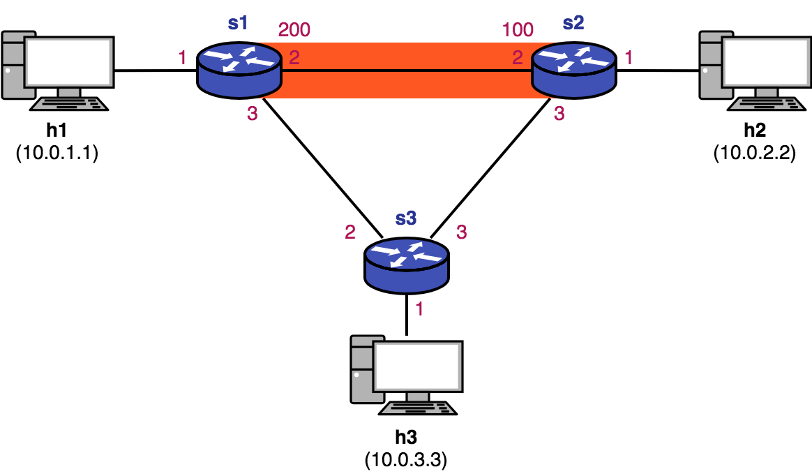
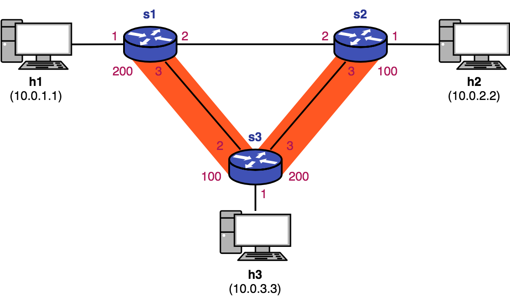

# Implementing a Control Plane using P4Runtime

## Introduction

This directory contains sample code to help students of INF01002 Communication Protocols (2019/1) and CMP182 Computer Networks (2019/01) of the Institute of Informatics (INF) of the Federal University of Rio Grande do Sul (UFRGS) with learning the basics of P4 programming.

It consists of a simple IPv4 and Tunnel forwarding application. `myprogram.p4` is used to program switches to do processing related to IPv4 forwarding and a simple tunneling technique. `master-controller.py` installs `myprogram.p4` into switches and configures them with the necessary rules to do IPv4 forwarding and also to use a special tunnel for traffic between two hosts in the topology. `stats-controller.py` periodically reads some counters of the switches and shows this information to the user. `topology.json` defines the topology of the testbed network emulated for this sample directory. The topology of the emulated network is shown bellow and is composed of three switches (`s1`, `s2`, `s3`) configured in a triangle, each connected to one host (`h1`, `h2`, and `h3`). The hosts are assigned IPs of `10.0.1.1`, `10.0.2.2`, and `10.0.3.3`.


## Running the sample code

1. In your terminal application, open three shells.

2. In the first shell, run: `make`, This will:
   * compile `myprogram.p4`, and
   * start a Mininet instance with three switches (`s1`, `s2`, and `s3`) configured in a triangle, each connected to one host each connected to one host (`h1`, `h2`, and `h3`).
   * The hosts are assigned IPs of `10.0.1.1`, `10.0.2.2`, and `10.0.3.3`.

3. You should now see a Mininet command prompt. Make `h1` send ICMP messages to `h2` with command `h1 ping h2`. Since at this moment no program and no forwarding rule have been installed into the switches, the ICMP packets will not reach `h2`.

4. To program the switches we will now launch the (master) controller. In the second opened shell, run: `./master-controller.py`.

   The procedure of the master controller is divided into four phases. The first phase will simply install the `myprogram.p4` code into switches. Since no forwarding rule has been configured into switches, ICMP packets will still not reach `h2` in this Phase #1.

5. After having started the master controller, we may now run the stats controller. This controller periodically reads counter values from switches to help us see what are the switches doing tunneling. To launch the stats controller, in the third shell, run `./stats-controller.py`. Initially it will print something similar to the following every other second.

   ```
   ----- Reading tunnel counters -----
   s1 MyIngress.ingressTunnelCounter 200:   0 packets --      0 bytes
   s3 MyIngress.forwardTunnelCounter 200:   0 packets --      0 bytes
   s2 MyIngress.egressTunnelCounter  200:   0 packets --      0 bytes

   s2 MyIngress.ingressTunnelCounter 100:   0 packets --      0 bytes
   s3 MyIngress.forwardTunnelCounter 100:   0 packets --      0 bytes
   s1 MyIngress.egressTunnelCounter  100:   0 packets --      0 bytes
   ```

6. Next, go back to the master controller shell and press `ENTER`. This controller will start the second phase. In this phase, the controller will populate the switches IPv4 forwarding tables with the necessary rules for every host in the topology to be able to send and receive packets from all of the other hosts.

   The ping session between hosts `h1` and `h2` should now start to work. Note that the TTL values reported by the ICMP messages is 62, which reflects the fact that there are two hops (`s1` and `s2`) in the shortest path from `h1` to `h2`. Note also, in the third shell, that all counters still have value `0`, since no tunneling has yet been configured on the switches.

7. Go back to the second shell and press `ENTER` to start the third master controller phase. This phase modifies some of the rules on the IPv4 forwarding table and configures new rules on the Tunneling table. This results in the creation of the orange tunnel using the shortest path from `h1` to `h2` shown in the figure below.

   

   Traffic from `h1` to `h2` will now be forwarded using this tunnel. `myprogram.p4` configures switches to decrease the TTL value of packets by 2 (instead of 1) when doing tunneling. Note that, now, the TTL values reported by the ICMP messages is 60, reflecting this TTL decreasing logic. The stats controller will also start showing values different from `0` since the ICMP packets are now being forwarded through the tunnel. More specifically, ingress and egress counters at `s1` and `s2` will have valeus greater than zero.
   >The rules created and modified at each phase of the master controller are shown in [this section](#table_rules) of this README.

8. Finally, in the second shell press `ENTER` to start the fourth and final phase. In this phase, the master controller reconfigures the tunnel created in the previous phase to use the alternate path `s1->s3->s2` (shown in the figure below) from `h1` to `h2`. With this new configuration, the TTL reported by the ICMP messages will now be 58, indicating packets are being routed through the three-hop tunneled path (64 - 2x3 = 58). The forwarding counters in `s3` will now start to be reported by the stats controller with values greater than 0.

   

This ends this step-by-step tutorial.

## <a name="table_rules">Table Rules by Phase</a>

### Phase 1

This phase only installs `myprogram.p4` into switches, so only default program-defined `drop()` rules are created.

#### Switch S1

##### Table ipv4_lpm

| Match (ipv4.dstAddr) |               Action and Parameters               | Status |
|:--------------------:|:-------------------------------------------------:|--------|
| default              | drop()                                            | NEW    |

##### Table myTunnel_exact

| Match (myTunnel.dst_id) |                 Action and Parameters                | Status |
|:-----------------------:|:----------------------------------------------------:|--------|
|         default         | drop()                                               | NEW    |

#### Switch S2

##### Table ipv4_lpm

| Match (ipv4.dstAddr) |               Action and Parameters               | Status |
|:--------------------:|:-------------------------------------------------:|--------|
| default              | drop()                                            | NEW    |

##### Table myTunnel_exact

| Match (myTunnel.dst_id) |                 Action and Parameters                | Status |
|:-----------------------:|:----------------------------------------------------:|--------|
|         default         | drop()                                               | NEW    |

#### Switch S3

##### Table ipv4_lpm

| Match (ipv4.dstAddr) |               Action and Parameters               | Status |
|:--------------------:|:-------------------------------------------------:|--------|
| default              | drop()                                            | NEW    |

##### Table myTunnel_exact

| Match (myTunnel.dst_id) |                 Action and Parameters                | Status |
|:-----------------------:|:----------------------------------------------------:|--------|
|         default         | drop()                                               | NEW    |

### Phase 2

#### Switch S1

##### Table ipv4_lpm

| Match (ipv4.dstAddr) |               Action and Parameters               | Status    |
|:--------------------:|:-------------------------------------------------:|-----------|
| 10.0.1.1/32          | ipv4_forward(dstAddr="00:00:00:00:01:01", port=1) | NEW       |
| 10.0.2.2/32          | ipv4_forward(dstAddr="00:00:00:02:02:00", port=2) | NEW       |
| 10.0.3.3/32          | ipv4_forward(dstAddr="00:00:00:03:03:00", port=3) | NEW       |
| default              | drop()                                            | UNCHANGED |

##### Table myTunnel_exact

| Match (myTunnel.dst_id) | Action and Parameters | Status    |
|:-----------------------:|:---------------------:|-----------|
|         default         | drop()                | UNCHANGED |

#### Switch S2

##### Table ipv4_lpm

| Match (ipv4.dstAddr) |               Action and Parameters               | Status    |
|:--------------------:|:-------------------------------------------------:|-----------|
| 10.0.1.1/32          | ipv4_forward(dstAddr="00:00:00:01:01:00", port=2) | NEW       |
| 10.0.2.2/32          | ipv4_forward(dstAddr="00:00:00:00:02:02", port=1) | NEW       |
| 10.0.3.3/32          | ipv4_forward(dstAddr="00:00:00:03:03:00", port=3) | NEW       |
| default              | drop()                                            | UNCHANGED |

##### Table myTunnel_exact

| Match (myTunnel.dst_id) | Action and Parameters | Status    |
|:-----------------------:|:---------------------:|-----------|
|         default         | drop()                | UNCHANGED |

#### Switch S3

##### Table ipv4_lpm

| Match (ipv4.dstAddr) |               Action and Parameters               | Status    |
|:--------------------:|:-------------------------------------------------:|-----------|
| 10.0.1.1/32          | ipv4_forward(dstAddr="00:00:00:01:01:00", port=2) | NEW       |
| 10.0.2.2/32          | ipv4_forward(dstAddr="00:00:00:02:02:00", port=3) | NEW       |
| 10.0.3.3/32          | ipv4_forward(dstAddr="00:00:00:00:03:03", port=1) | NEW       |
| default              | drop()                                            | UNCHANGED |

##### Table myTunnel_exact

| Match (myTunnel.dst_id) | Action and Parameters | Status    |
|:-----------------------:|:---------------------:|-----------|
|         default         | drop()                | UNCHANGED |

### Phase 3

#### Switch S1

##### Table ipv4_lpm

| Match (ipv4.dstAddr) |               Action and Parameters               | Status    |
|:--------------------:|:-------------------------------------------------:|-----------|
| 10.0.1.1/32          | ipv4_forward(dstAddr="00:00:00:00:01:01", port=1) | UNCHANGED |
| 10.0.2.2/32          | myTunnel_ingress(dst_id=200)                      | MODIFIED  |
| 10.0.3.3/32          | ipv4_forward(dstAddr="00:00:00:03:03:00", port=3) | UNCHANGED |
| default              | drop()                                            | UNCHANGED |

##### Table myTunnel_exact

| Match (myTunnel.dst_id) |                 Action and Parameters                | Status    |
|:-----------------------:|:----------------------------------------------------:|-----------|
| 100                     | myTunnel_egress(dstAddr="00:00:00:00:01:01", port=1) | NEW       |
| 200                     | myTunnel_forward(port=2)                             | NEW       |
|         default         | drop()                                               | UNCHANGED |

#### Switch S2

##### Table ipv4_lpm

| Match (ipv4.dstAddr) |               Action and Parameters               | Status    |
|:--------------------:|:-------------------------------------------------:|-----------|
| 10.0.1.1/32          | myTunnel_ingress(dst_id=100)                      | MODIFIED  |
| 10.0.2.2/32          | ipv4_forward(dstAddr="00:00:00:00:02:02", port=1) | UNCHANGED |
| 10.0.3.3/32          | ipv4_forward(dstAddr="00:00:00:03:03:00", port=3) | UNCHANGED |
| default              | drop()                                            | UNCHANGED |

##### Table myTunnel_exact

| Match (myTunnel.dst_id) |                 Action and Parameters                | Status    |
|:-----------------------:|:----------------------------------------------------:|-----------|
| 100                     | myTunnel_forward(port=2)                             | NEW       |
| 200                     | myTunnel_egress(dstAddr="00:00:00:00:02:02", port=1) | NEW       |
|         default         | drop()                                               | UNCHANGED |

#### Switch S3

##### Table ipv4_lpm

| Match (ipv4.dstAddr) |               Action and Parameters               | Status    |
|:--------------------:|:-------------------------------------------------:|-----------|
| 10.0.1.1/32          | ipv4_forward(dstAddr="00:00:00:01:01:00", port=2) | UNCHANGED |
| 10.0.2.2/32          | ipv4_forward(dstAddr="00:00:00:02:02:00", port=3) | UNCHANGED |
| 10.0.3.3/32          | ipv4_forward(dstAddr="00:00:00:00:03:03", port=1) | UNCHANGED |
| default              | drop()                                            | UNCHANGED |

##### Table myTunnel_exact

| Match (myTunnel.dst_id) | Action and Parameters | Status    |
|:-----------------------:|:---------------------:|-----------|
|         default         | drop()                | UNCHANGED |

### Phase 4

#### Switch S1

##### Table ipv4_lpm

| Match (ipv4.dstAddr) |               Action and Parameters               | Status    |
|:--------------------:|:-------------------------------------------------:|-----------|
| 10.0.1.1/32          | ipv4_forward(dstAddr="00:00:00:00:01:01", port=1) | UNCHANGED |
| 10.0.2.2/32          | myTunnel_ingress(dst_id=200)                      | UNCHANGED |
| 10.0.3.3/32          | ipv4_forward(dstAddr="00:00:00:03:03:00", port=3) | UNCHANGED |
| default              | drop()                                            | UNCHANGED |

##### Table myTunnel_exact

| Match (myTunnel.dst_id) |                 Action and Parameters                | Status    |
|:-----------------------:|:----------------------------------------------------:|-----------|
| 100                     | myTunnel_egress(dstAddr="00:00:00:00:01:01", port=1) | UNCHANGED |
| 200                     | myTunnel_forward(port=3)                             | MODIFIED  |
|         default         | drop()                                               | UNCHANGED |

#### Switch S2

##### Table ipv4_lpm

| Match (ipv4.dstAddr) |               Action and Parameters               | Status    |
|:--------------------:|:-------------------------------------------------:|-----------|
| 10.0.1.1/32          | myTunnel_ingress(dst_id=100)                      | UNCHANGED |
| 10.0.2.2/32          | ipv4_forward(dstAddr="00:00:00:00:02:02", port=1) | UNCHANGED |
| 10.0.3.3/32          | ipv4_forward(dstAddr="00:00:00:03:03:00", port=3) | UNCHANGED |
| default              | drop()                                            | UNCHANGED |

##### Table myTunnel_exact

| Match (myTunnel.dst_id) |                 Action and Parameters                | Status    |
|:-----------------------:|:----------------------------------------------------:|-----------|
| 100                     | myTunnel_forward(port=3)                             | MODIFIED  |
| 200                     | myTunnel_egress(dstAddr="00:00:00:00:02:02", port=1) | UNCHANGED |
|         default         | drop()                                               | UNCHANGED |

#### Switch S3

##### Table ipv4_lpm

| Match (ipv4.dstAddr) |               Action and Parameters               | Status    |
|:--------------------:|:-------------------------------------------------:|-----------|
| 10.0.1.1/32          | ipv4_forward(dstAddr="00:00:00:01:01:00", port=2) | UNCHANGED |
| 10.0.2.2/32          | ipv4_forward(dstAddr="00:00:00:02:02:00", port=3) | UNCHANGED |
| 10.0.3.3/32          | ipv4_forward(dstAddr="00:00:00:00:03:03", port=1) | UNCHANGED |
| default              | drop()                                            | UNCHANGED |

##### Table myTunnel_exact

| Match (myTunnel.dst_id) | Action and Parameters    | Status    |
|:-----------------------:|:------------------------:|-----------|
| 100                     | myTunnel_forward(port=2) | MODIFIED  |
| 200                     | myTunnel_forward(port=3) | MODIFIED  |
|         default         | drop()                   | UNCHANGED |
